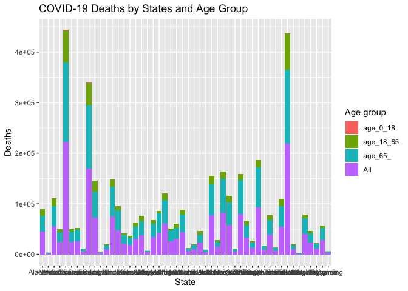
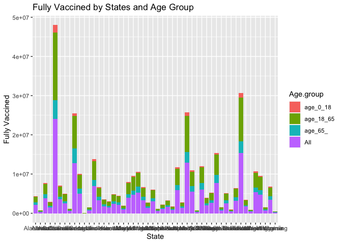
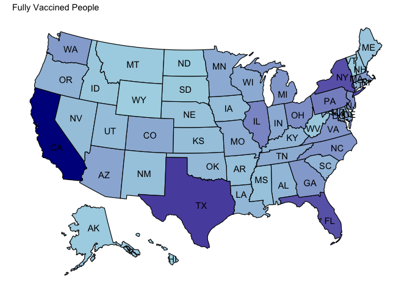
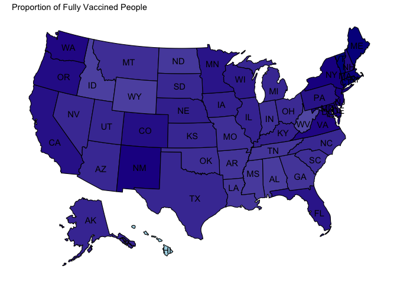
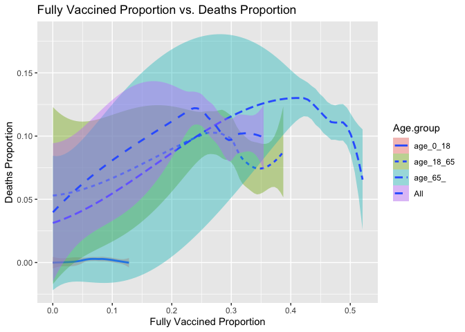

# Introduction

## Data Background

### Raw dataset

Three raw datasets are included in this analysis, which are COVID-19 deaths data by state and age group, COVID-19 fully vaccined data by state and age group and state population data:

* COVID-19 Deaths Data involves corona virus disease 2019 (COVID-19) and pneumonia reported to NCHS by jurisdiction of occurrence, place of death, and age group, collected from 01/01/2020 to 10/23/2021.

* COVID-19 Vaccinations Data includes the overall US COVID-19 Vaccine administration and vaccine equity data at county level, collected from 01/01/2020 to 10/23/2021.

* Population of 2019 Data involves the estimates of the Total Resident Population and Resident Population Age 18 Years and Older for the United States.

### Final dataset

Variables introduction:

+ Start.Date: Start date of data collection
  
+ End.Date: End date of data collection
  
+ State: State full name
  
+ state: State abbreviate name
  
+ Age.group: Age groups, which include <18 group, 18-65 group and 65+ group.
  
+ Deaths: Number of COVID-19 deaths
  
+ Deaths.prop: Proportion of COVID-19 deaths in total deaths
  
+ Vacc: Number of fully COVID-19 vaccined people
  
+ Vacc.prop: Proportion of fully COVID-19 vaccined in population

## Main question

What's the association between COVID-19 Deaths and fully vaccined status?

# Methods

### Data source

Provisional COVID-19 Deaths by Place of Death and Age: 
https://data.cdc.gov/NCHS/Provisional-COVID-19-Deaths-by-Place-of-Death-and-/4va6-ph5s

COVID-19 Vaccinations in the United States, County: 
https://data.cdc.gov/Vaccinations/COVID-19-Vaccinations-in-the-United-States-County/8xkx-amqh

Populations of 2019: 
https://www.census.gov/data/tables/time-series/demo/popest/2010s-state-detail.html

### Data acquisition and cleaning

#### Read in the data


```r
fn1 <- "cov_age.csv"
if (!file.exists(fn1))
  download.file("https://data.cdc.gov/api/views/4va6-ph5s/rows.csv?accessType=DOWNLOAD", destfile = fn1)

cov_age<-read.csv(fn1)
cov_age<-as_tibble(cov_age)

fn2 <- "cov_vacc.csv"
if (!file.exists(fn2))
  download.file("https://data.cdc.gov/api/views/8xkx-amqh/rows.csv?accessType=DOWNLOAD", destfile = fn2)

cov_vacc<-read.csv(fn2)
cov_vacc<-as_tibble(cov_vacc)

fn3 <- "pop.csv"
if (!file.exists(fn3))
  download.file("https://data.cdc.gov/api/views/k8wy-p9cg/rows.csv?accessType=DOWNLOAD", destfile = fn3)

pop<-read.csv(fn3)
pop<-as_tibble(pop)
```

#### Raw data cleaning

* In COVID-19 deaths data, the variables we are interested in counts of COVID-19 deaths by state and age group. Therefore, we

  + delete the variables that we don't need

  + reformat the numeric variables

  + replace missing values with 0

  + combine some of the age groups, so that the age group is clustered into three groups, 0-18, 18-65 and 65+

  + calculate the proportions of COVID-19 deaths among all deaths

  + add abbreviated state names to the data.


```r
# cov_age cleaning
cov_age <- cov_age[which(cov_age$State!="United States" & cov_age$Place.of.Death=="Total - All Places of Death"), c(2:3,8,10:12)]

cov_age$COVID.19.Deaths <- as.numeric(gsub(",","",cov_age$COVID.19.Deaths))
cov_age$Total.Deaths <- as.numeric(gsub(",","",cov_age$Total.Deaths))
cov_age[is.na(cov_age)] <- 0

cov_age <- as.data.table(cov_age)
cov_age[,age_group := fifelse(Age.group=="All Ages", "All",
                              fifelse(Age.group=="0-17 years", "age_0_18",
                                      fifelse(Age.group=="65-74 years" | cov_age$Age.group=="75-84 years" | cov_age$Age.group=="85 years and over", "age_65_", "age_18_65")))]

cov_age <- cov_age %>% 
  group_by(State, age_group) %>% 
  mutate(
  COVID.19.Deaths = sum(COVID.19.Deaths),
  Total.Deaths = sum(Total.Deaths)
)
cov_age <- cov_age[,-4]
cov_age <- cov_age %>% distinct(COVID.19.Deaths, .keep_all= TRUE)

cov_age <- cov_age %>% 
  mutate(
  COVID.19.Deaths.prop = COVID.19.Deaths/Total.Deaths)

# add state names

state_name <- cbind(state.abb,state.name)
cov_age <- merge(
  x = cov_age,
  y = state_name,
  all.x = TRUE, all.y = FALSE,
  by.x = "State",
  by.y = "state.name"
)
cov_age <- na.omit(cov_age)
cov_age <- cov_age[,-5]
```

* In COVID-19 fully vaccined data, the variables we are interested in are the counts of fully vaccined people by age group and state. Therefore, we

  + delete the variables that we don't need

  + reformat the numeric variable

  + replace missing values with 0

  + add full state names to the data


```r
# cov_vacc cleaning
cov_vacc <- cov_vacc[which(cov_vacc$Date==cov_vacc$Date[1]),c(1,4,5,7:8,10,12)]
cov_vacc <- cov_vacc %>% arrange(Recip_State,Recip_County)
  
  # remove county variable
cov_vacc$Series_Complete_Yes <- as.numeric(gsub(",","",cov_vacc$Series_Complete_Yes))
cov_vacc$Series_Complete_12Plus <- as.numeric(gsub(",","",cov_vacc$Series_Complete_12Plus))
cov_vacc$Series_Complete_18Plus <- as.numeric(gsub(",","",cov_vacc$Series_Complete_18Plus))
cov_vacc$Series_Complete_65Plus <- as.numeric(gsub(",","",cov_vacc$Series_Complete_65Plus))
cov_vacc[is.na(cov_vacc)] <- 0
cov_vacc <- cov_vacc %>% 
  group_by(Recip_State) %>% 
  mutate(
  Series_Complete_Yes_sum = sum(Series_Complete_Yes),
  Series_Complete_12Plus_sum = sum(Series_Complete_12Plus),
  Series_Complete_18Plus_sum = sum(Series_Complete_18Plus),
  Series_Complete_65Plus_sum = sum(Series_Complete_65Plus)
)
cov_vacc <- cov_vacc[,-c(2,4:7)]
cov_vacc <- cov_vacc %>% distinct(Series_Complete_Yes_sum, .keep_all= TRUE)
cov_vacc <- cov_vacc %>% 
  mutate(
  All  = Series_Complete_Yes_sum,
  age_0_18  = Series_Complete_Yes_sum - Series_Complete_18Plus_sum,
  age_18_65 = Series_Complete_18Plus_sum - Series_Complete_65Plus_sum,
  age_65_ = Series_Complete_65Plus_sum
)
cov_vacc <- cov_vacc[,-c(3:6)]
cov_vacc <- cov_vacc %>% gather(age_group, vacc_complete, 3:6)

colnames(cov_vacc)[2] <- "state.abb"

# add state names
cov_vacc <- merge(
  x = cov_vacc,
  y = state_name,
  all.x = TRUE, all.y = FALSE,
  by = "state.abb"
)
cov_vacc <- na.omit(cov_vacc)
colnames(cov_vacc)[5] <- "State"
cov_vacc <- cov_vacc[,-2]
```

* In state population data, the variables that we are concerned about is the population of different states and age groups. Therefore, we

  + delete the variables that we don't need

  + cluster age into three groups, 0-18, 18-65 and 65+


```r
# cov_pop cleaning
pop <- pop[which(pop$NAME!="United States"),c(5,7,18)]
colnames(pop) <- c("State","AGE","Population")

pop <- as.data.table(pop)
pop[,age_group := fifelse(AGE==999, "All",
                              fifelse(AGE<18, "age_0_18",
                                      fifelse(AGE>65, "age_65_", "age_18_65")))]
pop <- pop %>% 
  group_by(State, age_group) %>% 
  mutate(
  Population = sum(Population)
)
pop <- pop[,-2]
pop <- pop %>% distinct(Population, .keep_all= TRUE)
```

#### Data merging and cleaning

First, check the dimensions of the datasets.


```r
dim_age <- dim(cov_age)
knitr::kable(dim_age)
```


|   x|
|---:|
| 200|
|   7|

```r
dim_vacc <- dim(cov_vacc)
knitr::kable(dim_vacc)
```


|   x|
|---:|
| 200|
|   4|

```r
dim_pop <- dim(pop)
knitr::kable(dim(pop))
```


|   x|
|---:|
| 204|
|   3|

The COVID-19 deaths data and the fully vaccined data have same number of columns. The population data have one more state data than the other two datasets. So, it should be mentioned here that the extra data will be deleted during data merging step.

After checking the heads and tails and making sure that the datasets have good dimensions, we merge the datasets and do some cleaning to get the final data for analysis.


```r
# order before merging
cov_age <- cov_age[order(cov_age[, "State"], cov_age[, "age_group"] ),]
cov_vacc <- cov_vacc[order(cov_vacc[, "State"], cov_vacc[, "age_group"] ),]
pop <- pop[order(pop[, "State"], pop[, "age_group"]),]

# merging
cov_vacc <- merge(
  x = cov_vacc,
  y = pop,
  all.x = TRUE, all.y = FALSE
)
cov_vacc <- cov_vacc %>% 
  mutate(
  vacc_prop = vacc_complete/Population
)
cov_vacc <- cov_vacc[,-5]

cov_age_vacc <- merge(
  x = cov_age,
  y = cov_vacc,
  all.x = TRUE, all.y = FALSE
)

# cleaning
rm(cov_age)
rm(cov_vacc)
rm(pop)
cov_age_vacc <- cov_age_vacc[, c(4,5,1,3,2,6:9)]
colnames(cov_age_vacc)[4:9] <- c("state","Age.group","Deaths","Deaths.prop","Vacc","Vacc.prop")
```

Therefore, we get the final data.

### Methods

Descriptive analysis is done by summarizing statistics of the variables that this study concern about. Plots are shown by bar charts and maps, in order to have a straight forward view of the concerned variables. The main question of this study is explored using correlation analysis and smooth graph, based on proportion data.

# Preliminary Results

### Results of descriptive analysis

Summarizes of statistics are shown in tables.


```r
cov_age_vacc <- as.data.table(cov_age_vacc)
table_state <- cov_age_vacc[cov_age_vacc$Age.group=="All", .(
  "COVID-19 Deaths" = Deaths,
  "COVID-19 Deaths proportion" = round(Deaths.prop,3),
  "COVID-19 Fully Vaccined" = Vacc,
  "COVID-19 Fully Vaccined proportion" = round(Vacc.prop,3)
),
by = State]
knitr::kable(table_state)
```


|State          | COVID-19 Deaths| COVID-19 Deaths proportion| COVID-19 Fully Vaccined| COVID-19 Fully Vaccined proportion|
|:--------------|---------------:|--------------------------:|-----------------------:|----------------------------------:|
|Alabama        |           44665|                      0.130|                 2174923|                              0.222|
|Alaska         |            1885|                      0.072|                  382206|                              0.268|
|Arizona        |           55617|                      0.134|                 3833436|                              0.264|
|Arkansas       |           25035|                      0.122|                 1435635|                              0.238|
|California     |          221775|                      0.129|                23996305|                              0.305|
|Colorado       |           24684|                      0.100|                 3518233|                              0.307|
|Connecticut    |           26013|                      0.140|                 2506712|                              0.352|
|Delaware       |            5922|                      0.103|                  579053|                              0.298|
|Florida        |          169626|                      0.125|                12735114|                              0.297|
|Georgia        |           72991|                      0.131|                 5051114|                              0.239|
|Hawaii         |            2603|                      0.040|                     677|                              0.000|
|Idaho          |            9762|                      0.110|                  774512|                              0.217|
|Illinois       |           74355|                      0.114|                 6897110|                              0.273|
|Indiana        |           47724|                      0.117|                 3335846|                              0.248|
|Iowa           |           20676|                      0.115|                 1741874|                              0.276|
|Kansas         |           18281|                      0.113|                 1537120|                              0.266|
|Kentucky       |           30885|                      0.105|                 2430217|                              0.273|
|Louisiana      |           38212|                      0.130|                 2197714|                              0.237|
|Maine          |            3641|                      0.043|                  942331|                              0.351|
|Maryland       |           33993|                      0.110|                 3975616|                              0.331|
|Massachusetts  |           42932|                      0.123|                 4774540|                              0.347|
|Michigan       |           60214|                      0.102|                 5308437|                              0.266|
|Minnesota      |           25527|                      0.096|                 3354220|                              0.297|
|Mississippi    |           30516|                      0.147|                 1348618|                              0.228|
|Missouri       |           43887|                      0.111|                 3031195|                              0.248|
|Montana        |            6640|                      0.105|                  533674|                              0.251|
|Nebraska       |           10014|                      0.100|                 1082184|                              0.281|
|Nevada         |           23142|                      0.136|                 1614965|                              0.263|
|New Hampshire  |            4521|                      0.063|                  851413|                              0.313|
|New Jersey     |           77667|                      0.164|                 5857313|                              0.330|
|New Mexico     |           14483|                      0.121|                 1374772|                              0.330|
|New York       |           81585|                      0.131|                12850740|                              0.331|
|North Carolina |           57839|                      0.109|                 5477118|                              0.264|
|North Dakota   |            5744|                      0.133|                  348646|                              0.231|
|Ohio           |           79755|                      0.107|                 6023303|                              0.258|
|Oklahoma       |           33029|                      0.133|                 1961771|                              0.249|
|Oregon         |           12999|                      0.060|                 2634171|                              0.312|
|Pennsylvania   |           93255|                      0.115|                 7685449|                              0.300|
|Rhode Island   |            8419|                      0.138|                  745471|                              0.353|
|South Carolina |           38820|                      0.120|                 2546443|                              0.249|
|South Dakota   |            6738|                      0.135|                  461874|                              0.262|
|Tennessee      |           54996|                      0.115|                 3228989|                              0.237|
|Texas          |          218261|                      0.159|                15347006|                              0.266|
|Utah           |            9821|                      0.083|                 1700562|                              0.266|
|Vermont        |             912|                      0.028|                  441800|                              0.354|
|Virginia       |           39576|                      0.093|                 5338270|                              0.317|
|Washington     |           23377|                      0.069|                 4797997|                              0.317|
|West Virginia  |           11413|                      0.092|                  734102|                              0.205|
|Wisconsin      |           28448|                      0.089|                 3373184|                              0.290|
|Wyoming        |            2924|                      0.100|                  251662|                              0.219|

Table 1  Number and proportion of deaths and fully vaccined people

* We can see that the three states that have the highest deaths are California, Texas and Florida, which have 221,775, 218,261 and 169,626, respectively. Also, the three states that have the highest proportion of deaths in total deaths are New Jersey, Mississippi and Connecticut, which are 16.4%, 14.7% and 14%, respectively. As for the condition of fully vaccined, the three states that have the highest number are California, Texas and New York, which are 23,996,305, 15,347,006 and 12,850,740, respectively. Additionally, the three states that have the highest proportion of fully vaccined in the population are Vermont, Maine and Connecticut, which are 35.4%, 35.2% and 35.1%, respectively.


```r
table_age <- cov_age_vacc[, .(
  "Average of deaths" = round(mean(Deaths),0),
  "Average of proportation of deaths" = round(mean(Deaths.prop),3),
  "Average of fully vaccined" = round(mean(Vacc),0),
  "Average of proportation of fully vaccined" = round(mean(Vacc.prop),3)
), by = Age.group]
knitr::kable(table_age)
```


|Age.group | Average of deaths| Average of proportation of deaths| Average of fully vaccined| Average of proportation of fully vaccined|
|:---------|-----------------:|---------------------------------:|-------------------------:|-----------------------------------------:|
|age_0_18  |                16|                             0.002|                    242661|                                     0.078|
|age_18_65 |              9795|                             0.089|                   2554933|                                     0.300|
|age_65_   |             31530|                             0.115|                    904920|                                     0.448|
|All       |             41516|                             0.109|                   3702513|                                     0.274|

Table 2  Number and proportion of deaths and fully vaccined people

* The age group description table shows that people older than 65 years old have both the highest number of average deaths in all states and the highest proportion of deaths in total deaths, which are 31,530 and 0.115. More number of people age between 18 and 65 have fully vaccined compared to the other two groups, which is 2,554,933. But larger proportion of older people have fully vaccined compared to younger people.

### Plots

Show bar charts and map to have a better view of the condition of COVID-19 Deaths in different states among age groups.


```r
ggplot(cov_age_vacc,aes(x=State, y=Deaths, fill=Age.group)) + 
  geom_bar(stat = 'identity') + 
  labs(title = "COVID-19 Deaths by States and Age Group", x  = "State", y = "Deaths")
```

<!-- -->

```r
ggplot(cov_age_vacc,aes(x=State, y=Deaths.prop, fill=Age.group)) + 
  geom_bar(stat = 'identity') + 
  labs(title = "COVID-19 Deaths by States and Age Group", x  = "State", y = "Deaths")
```

<!-- -->

```r
plot_usmap(regions = 'states', data = cov_age_vacc[cov_age_vacc$Age.group=="All",], values ='Deaths', labels = TRUE, label_color = "black") +
  scale_fill_continuous(low = "orange", high = "orange4", guide = "none") + 
  labs(title = "COVID-19 Deaths")
```

<!-- -->

```r
plot_usmap(regions = 'states', data = cov_age_vacc[cov_age_vacc$Age.group=="All",], values ='Deaths.prop', labels = TRUE, label_color = "black") +
  scale_fill_continuous(low = "orange", high = "orange4", guide = "none") + 
  labs(title = "Proportion of COVID-19 Deaths")
```

<!-- -->

* States that are darker in the maps have more deaths or larger proportion of deaths.

Show bar charts and map to have a better view of the condition of fully vaccined in different states among age groups.


```r
ggplot(cov_age_vacc,aes(x=State, y=Vacc, fill=Age.group)) + 
  geom_bar(stat = 'identity') + 
    labs(title = "Fully Vaccined by States and Age Group", x  = "State", y = "Fully Vaccined")
```

<!-- -->

```r
ggplot(cov_age_vacc,aes(x=State, y=Vacc.prop, fill=Age.group)) + 
  geom_bar(stat = 'identity') + 
  labs(title = "Fully Vaccined by States and Age Group", x  = "State", y = "Fully Vaccined")
```

<!-- -->

```r
plot_usmap(regions = 'states', data = cov_age_vacc[cov_age_vacc$Age.group=="All",], values ='Vacc', labels = TRUE, label_color = "black") +
  scale_fill_continuous(low = "lightblue", high = "darkblue", guide = "none") + 
  labs(title = "Fully Vaccined People")
```

<!-- -->

```r
plot_usmap(regions = 'states', data = cov_age_vacc[cov_age_vacc$Age.group=="All",], values ='Vacc.prop', labels = TRUE, label_color = "black") +
  scale_fill_continuous(low = "lightblue", high = "darkblue", guide = "none") + 
  labs(title = "Proportion of Fully Vaccined People")
```

<!-- -->

* States that are darker in the maps have larger number or proportion of people who were fully vaccined.

### Main question

The association between COVID-19 Deaths and fully vaccined status is explored by correlation analysis of the proportion of COVID-19 deaths in all deaths and the proportion of fully vaccined people in the population.


```r
cor <- cor(cov_age_vacc[cov_age_vacc$Age.group=="All",]$Deaths.prop, cov_age_vacc[cov_age_vacc$Age.group=="All",]$Vacc.prop)
knitr::kable(cor, col.names = "correlation")
```


| correlation|
|-----------:|
|    0.072618|

* The correlation between these two variables is 0.07, which is close to 0. Therefore, these two variables are not related.

The association between COVID-19 Deaths and fully vaccined status in different age groups is also showed in this smooth graph.


```r
ggplot(data = cov_age_vacc) + 
  geom_smooth(mapping = aes(x = Vacc.prop, y = Deaths.prop, linetype = Age.group, fill = Age.group)) + 
    labs(title = "Fully Vaccined Proportion vs. Deaths Proportion", x  = "Fully Vaccined Proportion", y = "Deaths Proportion")
```

<!-- -->

* The plot shows that there is no definite or fixed trend in the relationship between the two variables. There seems to have a increasing trend when the fully vaccined proportion is small, but a turning point appears when the proportion increases. Still, the confidence intervals are quite wide as shown in the plot, so the trends are not reliable. 

# Conclusion

There is no association between COVID-19 Deaths and fully vaccined status in different age groups. It is also found that people over the age of 65 have the highest deaths, which means that younger people are more likely to survive from COVID-19. Meanwhile, people older than 65 years old have the largest proportion of having been fully vaccined among the whole population. 
